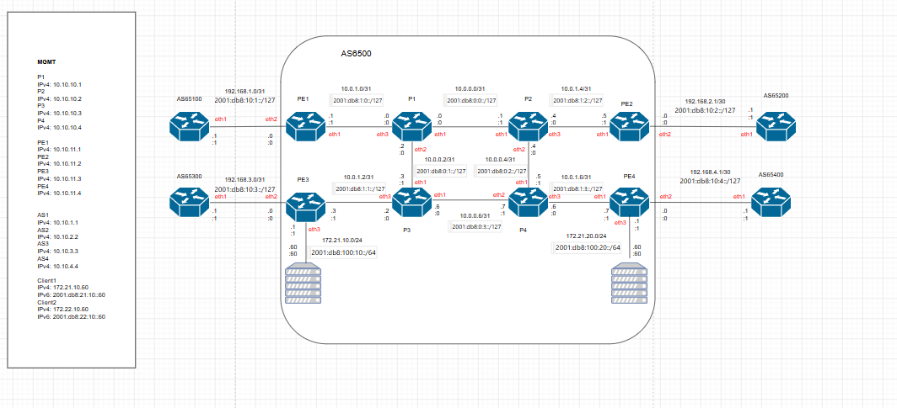

# Nokia SROS SPLab

This repository contains a containerlab-based lab for exploring Nokia SROS networking concepts, automated configuration deployment, and service-provider-style routing scenarios. The environment combines containerized network nodes, NetBox-backed inventory data, and Nornir-based automation to support lab-driven configuration workflows.

## Overview

The lab is designed to provide a realistic learning and validation environment for:
- Nokia SR-SIM routers running SROS
- Cisco IOS-based routers for external autonomous-system simulation
- Linux-based client nodes
- Automation workflows built with Nornir, Ansible, and NetBox-related components

The goal is to model a multi-domain service-provider topology where routing, provisioning, and configuration automation can be exercised end to end.

## Topology

The main topology is defined in [clab/lab.clab.yml](clab/lab.clab.yml).

### Devices included
- Core routers: p1, p2, p3, p4
- Provider edge routers: pe1, pe2, pe3, pe4
- Autonomous systems: as1, as2, as3, as4
- Client hosts: client1, client2

### Topology layout
- A core ring is built between p1, p2, p3, and p4
- Each PE router is connected to one core router
- Each PE router establishes eBGP peering with one AS router
- Client hosts are connected to pe3 and pe4

> A valid SR-SIM license file is required to run the Nokia nodes, and the topology file in [clab/lab.clab.yml](clab/lab.clab.yml) may need to be adjusted to point to the correct license path.

## Repository structure

- [clab](clab): containerlab topology files, licenses, and generated lab artifacts
- [src](src): configuration templates, inventory, and automation modules
- [backup-netbox](backup-netbox): scripts related to NetBox database backup and restore
- [netbox-docker](netbox-docker): a local NetBox deployment stack used by the automation workflow

## Prerequisites

Before starting, ensure the following tools are available:
- Docker or Podman
- containerlab
- Python 3.12+
- Access to an SR-SIM license for the Nokia routers

## Quick start

1. Install the Python dependencies from [pyproject.toml](pyproject.toml).
2. Start the NetBox environment from [netbox-docker](netbox-docker) and import the provided backup data using the script in [backup-netbox](backup-netbox).
3. Deploy the lab with containerlab using [clab/lab.clab.yml](clab/lab.clab.yml).
4. Use the automation modules in [src](src) to render and push configurations.
5. Run the deployment entry point for one or more devices.

### Example commands

Render and preview configuration payloads without pushing:
- python -m src.nornir_tasks.deploy_config --dry-run --devices PE3 PE4

Render configuration only:
- python -m src.nornir_tasks.deploy_config --skip-push --devices PE3 PE4

Render and push configuration to the selected devices:
- python -m src.nornir_tasks.deploy_config --devices PE3 PE4

## Current status

The project is actively evolving. The topology, NetBox integration, and automation flow are already in place, while some documentation and operational examples continue to be refined.

## Notes

This repository is intended as a practical starting point for experimenting with Nokia SROS automation in a lab environment. As the project matures, the documentation and example workflows will be expanded to cover more scenarios and validation steps.
